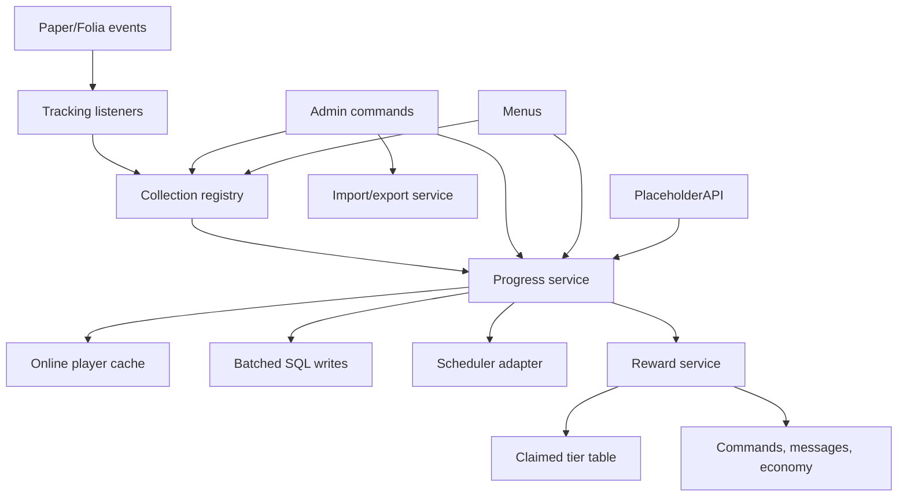

# Architecture

This page explains how RuinedCollections is put together.

## Main Parts

| Part | Job |
| --- | --- |
| `CollectionRegistry` | Loads and validates collection YAML files |
| `ProgressService` | Tracks online progress and batches saves |
| `CollectionRepository` | Handles SQL reads and writes |
| `RewardService` | Claims tiers and runs rewards |
| `MenuService` | Builds collection menus |
| `DataSnapshotService` | Exports and imports data |
| `PlacedBlockService` | Protects block collections from place-break farming |
| `HookManager` | Connects optional plugins |
| `SchedulerAdapter` | Routes async, global, and player tasks through Paper or Folia schedulers |

## Storage Flow

1. A player triggers a tracked action.
2. The listener asks the registry which collections match.
3. Progress is added to the online session.
4. Pending progress is queued.
5. The async flush writes batched progress to SQL.
6. Shutdown flushes pending progress before the plugin disables.

## Reward Flow

1. Progress reaches a tier goal.
2. The service checks whether the tier was already claimed.
3. The repository inserts a claimed-tier row.
4. If the insert succeeds, rewards run through the player scheduler.
5. If the row already exists, rewards do not run again.

## Why SQL

SQL gives the plugin:

- safer large-server storage
- clear export/import behavior
- duplicate reward protection
- future migration support
- easy backups

SQLite is simple for smaller servers. MySQL/MariaDB is better for larger servers and networks.

## Paper And Folia

The plugin keeps the release runtime target at Paper `1.21-R0.1-SNAPSHOT` and `api-version: '1.21'` for the Paper/Folia `1.21` through `26.1.2` support range. Compatibility builds can override `paper.api.version` to compile-check against newer Paper API versions.

On Paper, scheduled work uses Bukkit's normal scheduler. On Folia, async work uses the async scheduler, plugin-wide tasks use the global region scheduler, and player-facing work such as menus, reward checks, and player messages uses the player's entity scheduler.
